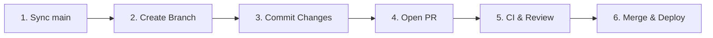

# GitHub Flow Skill

Use this skill when developing a feature, bug fix, or chore following GitHub Flow principles.

---

## The 6 Steps of GitHub Flow



---

## Workflow Instructions

### Step 1: Ensure Clean State & Sync `main`
Before branching, make sure the local `main` branch is clean and up to date with the remote:
```bash
git checkout main
git pull origin main
```

### Step 2: Create a Descriptive Topic Branch
Branch names must follow conventional naming:
- `feat/<short-title>` for new capabilities
- `fix/<short-title>` for bug fixes
- `refactor/<short-title>` for code restructuring
- `chore/<short-title>` for tooling/dependencies
- `docs/<short-title>` for documentation updates

```bash
git checkout -b feat/fermentation-dashboard
```

### Step 3: Implement & Commit with Conventional Messages
- Keep commits atomic and logically separated.
- Run local verification (build and tests) before committing:
  ```bash
  git add <modified-files>
  git commit -m "feat(frontend): implement fermentation temperature graph"
  ```
- Push topic branch to remote:
  ```bash
  git push -u origin <branch-name>
  ```

### Step 4: Open a Pull Request (PR)
Create a Pull Request using GitHub CLI (`gh`):
```bash
gh pr create --title "feat(frontend): implement fermentation temperature graph" --body-file .github/pull_request_template.md
```
*Ensure all sections of the PR template are completed.*

### Step 5: Verify CI Status & Review Feedback
- Monitor CI status checks:
  ```bash
  gh pr checks
  ```
- If any check fails, inspect logs, fix locally, commit, and push.
- If review comments are submitted, address them promptly in follow-up commits.

### Step 6: Merge & Cleanup
Once all CI checks are green and required approvals are obtained:
- Use **Squash and Merge** (or rebase if requested):
  ```bash
  gh pr merge --squash --delete-branch
  ```
- Return to `main` and pull updated state:
  ```bash
  git checkout main
  git pull origin main
  ```
